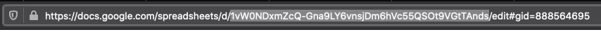

# PyAssinaMail
Gera assinaturas de email automagicamente a partir de uma planilha no google spreadsheets

[](https://pyup.io/repos/github/tiagocordeiro/pyassinamail/)
[](https://pyup.io/repos/github/tiagocordeiro/pyassinamail/)
[](https://travis-ci.org/tiagocordeiro/pyassinamail)
[](https://codecov.io/gh/tiagocordeiro/pyassinamail)
[](https://github.com/tiagocordeiro/pyassinamail/blob/master/LICENSE)

[](https://www.youtube.com/watch?v=WYjf94H-Lm0)

#### Como usar
Antes de mais nada você precisa ter uma planilha online como a do exemplo:

> [Planilha Google de exemplo](https://docs.google.com/spreadsheets/d/1vW0NDxmZcQ-Gna9LY6vnsjDm6hVc55QSOt9VGtTAnds/)

> O compartilhamento de links deve estar `Ativado`


> Agora você precisa do ID da planilha, você pode pegar na url.




#### Como rodar o projeto
* Clone esse repositório.
* Crie um virtualenv com Python 3.
* Ative o virtualenv.
* Instale as dependências.
* Rode o script

```shell
git clone https://github.com/tiagocordeiro/pyassinamail.git
cd pyassinamail
python3 -m venv venv
source venv/bin/activate
pip install --upgrade pip
pip install -r requirements.txt
python contrib/env_gen.py
python app.py
```

Os arquivos `.html` serão gerados na pasta `assinaturas/`

> Exemplo de uso com template
```shell
python app.py --template chemical.html
```

> Importando no seu projeto
```shell
>>> from app import gera_assinatura_html
>>> assinaturas = gera_assinatura_html
>>> assinaturas.callback()
{'retorno': {'assinaturas': [('Foo', 'Bar', 'dev@foo.bar'), ('Bar', 'Foo', 'dev@bar.foo')]}}

```

#### Testes, contribuição e dependências de desenvolvimento
Para instalar as dependências de desenvolvimento
```shell
pip install -r requirements-dev.txt
```

Para rodar os testes
```shell
pytest --cov='.' tests.py -v
python -m doctest README.md -v
```

Para gerar o relatório de cobertura de testes
```shell
coverage html
```

Verificando o `Code style`
```shell
pycodestyle .
flake8 .
```


#### Contributing
Pull requests are welcome. For major changes, please open an issue first to discuss what you would like to change.

Please make sure to update tests as appropriate.


### Thanx
- [[ ~ Dependencies scanned by PyUp.io ~ ]](https://pyup.io/)

#### License
[MIT](https://github.com/tiagocordeiro/pyassinamail/blob/master/LICENSE)