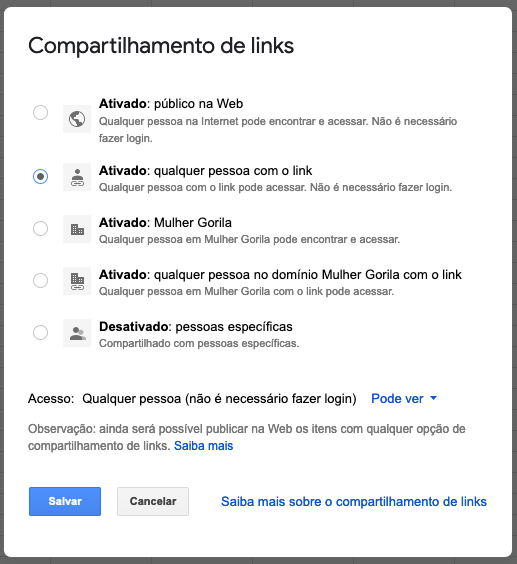
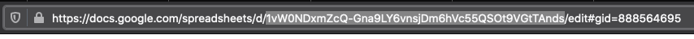

# PyAssinaMail

Automagically generates email signatures from a Google Spreadsheets spreadsheet.

[](https://pyup.io/repos/github/tiagocordeiro/pyassinamail/)
[](https://pyup.io/repos/github/tiagocordeiro/pyassinamail/)
[](https://travis-ci.org/tiagocordeiro/pyassinamail)
[](https://codecov.io/gh/tiagocordeiro/pyassinamail)
[](https://github.com/tiagocordeiro/pyassinamail/blob/master/LICENSE)

[](https://www.youtube.com/watch?v=WYjf94H-Lm0)

#### How to Use
Before anything else, you need to have an online spreadsheet like the example below:

> [Example Google Spreadsheet](https://docs.google.com/spreadsheets/d/1vW0NDxmZcQ-Gna9LY6vnsjDm6hVc55QSOt9VGtTAnds/)

> Link sharing must be enabled.



Now you need the spreadsheet's ID, which you can find in the URL.



#### How to Run the Project
* Clone this repository.
* Create a virtual environment with Python 3.
* Activate the virtual environment.
* Install the dependencies.
* Run the script

```shell
git clone https://github.com/tiagocordeiro/pyassinamail.git
cd pyassinamail
python3 -m venv venv
source venv/bin/activate
pip install --upgrade pip
pip install -r requirements.txt
python contrib/env_gen.py
python app.py
```

The `.html` files will be generated in the `assinaturas/` folder.

> Example of usage with a template
```shell
python app.py --template chemical.html
```

> Importing into your project
```shell
>>> from app import gera_assinatura_html
>>> signatures = gera_assinatura_html
>>> signatures.callback()
{'retorno': {'assinaturas': [('Foo', 'Bar', 'dev@foo.bar'), ('Bar', 'Foo', 'dev@bar.foo')]}}

```

#### Tests, Contribution, and Development Dependencies
To install development dependencies
```shell
pip install -r requirements-dev.txt
```

To run the tests
```shell
pytest --cov='.' tests.py -v
python -m doctest README.md -v
```

To generate the test coverage report
```shell
coverage html
```

Checking the `Code style`
```shell
pycodestyle .
flake8 .
```


#### Contributing
Pull requests are welcome. For major changes, please open an issue first to discuss what you would like to change.

Please make sure to update tests as appropriate.


### Thanks
- [[ ~ Dependencies scanned by PyUp.io ~ ]](https://pyup.io/)

#### License
[MIT](https://github.com/tiagocordeiro/pyassinamail/blob/master/LICENSE)